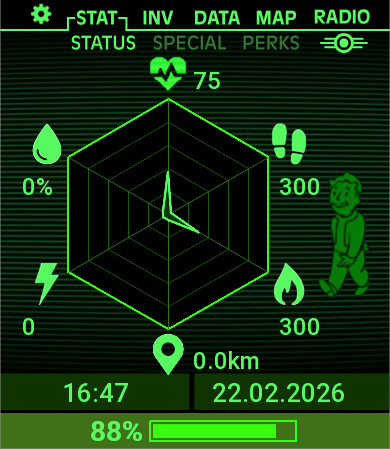

# SpiderWeb Health Watchface 🕸️



A custom Fallout Pip-Boy inpired, data-rich AMOLED watch face built for Zepp OS (specifically aimed at the **Amazfit Bip 6**). 
This watch face utilizes a dynamic spider web radar chart to visualize six core health metrics at a glance, allowing you to instantly understand your daily physical performance relative to your goals.

## Core Features
- **Dynamic Radar Chart**: Live data visualization charting your daily progress across 6 different physiological axes.
- **Battery Saver Lifecycle**: Integrated `onPause`/`onResume` hooks intelligently suspend heavy background 
    canvas rendering while the display is dark, saving massive amounts of battery and CPU.
- **Real-Time BPM & Stress**: Bypasses the standard un-reliable polling mechanism for Heart Rate 
     and Stress metrics, listening directly to active OS sensors. 
- **Auto-Scaling Engine**: A dynamic image bounds resolver that recalculates canvas elements against 
    `getDeviceInfo().width` to avoid clipping errors when installing to physical displays.

## Visualized Metrics
The spider web chart expands from the center (0%) to the outer glowing ring (100%) indicating your progress towards a goal:
* ❤️ **Heart Rate (Top)**: Maxes out mapping to 200 BPM. 
* 👟 **Steps (Top Right)**: Fills out at 10,000 daily steps.
* 🔥 **Calories (Bottom Right)**: Fills out at 1,000 active calories burned.
* 📍 **Distance (Bottom)**: Fills out at 8.0km traveled.
* ⚡ **Stress (Bottom Left)**: Maps 0-100 to the Zepp internal HRV algorithm.
* 🩸 **SpO2 (Top Left)**: Maps your current Blood Oxygen level (0-100%).

## Setup & Dependencies

Before beginning, ensure you have **Node.js** and **npm** installed on your system.
This project uses the official Zeus CLI for Zepp OS development.

```bash
# 1. Clone the repository
git clone https://github.com/your-username/SpiderwebWatchface.git
cd SpiderwebWatchface

# 2. Install dependencies (Zeus CLI core)
npm install
```

## Running & Installing on the Watch

### 1. Developer Mode
Ensure Developer Mode is enabled on both your **Zepp Phone App** and your physical watch. 
You can enable this by tapping your profile icon in the Zepp app repeatedly. Make sure your watch and your phone are on the same Wi-Fi network that your PC is on.

### 2. Login
Link your computer's CLI to your Zepp developer account:
\\\bash
npx @zeppos/zeus-cli login
\\\

### 3. Connect the Simulator / Device
You can preview the watchface either on an emulated watch on your desktop or directly on your wrist!

**Start the Zepp Emulator (Optional):**
\\\bash
npx @zeppos/zeus-cli dev
\\\

**Connect via QR Code (Physical Install):**
Start the build bridge service. It will generate a QR code in the terminal.
\\\bash
npx @zeppos/zeus-cli preview
\\\
1. Open the Zepp App on your smartphone.
2. Navigate to your Profile > Select your Watch > Developer Mode.
3. Tap "Scan" and point your phone camera at the QR code string in your terminal. 
4. The `.zab` watch face bundle will be compiled, pushed via Wi-Fi to your phone, and then installed onto your Amazfit watch!

## Building for Production
If you want to package the watchface into a standalone `.zab` file for manual sideloading or preparing it for submission to the Zepp App Store, run:
\\\bash
npx @zeppos/zeus-cli build
\\\
The compiled `.zab` bundle will be generated inside the `./dist/` folder.

## Authors
- Originally written to explore Zepp OS API levels, sensor access, and real-time JS canvas drawing inside an embedded hardware environment.
